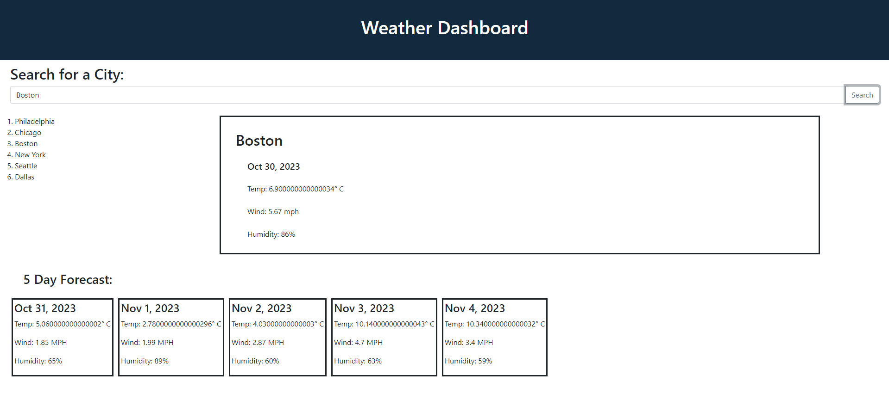

# Weather-Dashboard

Webpage which accepts user input and displays today's weather and also a 5 day weather forecast in a nice looking dashboard view

## Description

This dashboard application uses Open Weather Map's open source API to gather and display live weather data based on user input. The user has the option to input any city into an open text field, from here two api calls are made. The first gathers the latitude and longitude of the user's selection and the second takes those lat/long values as parameters and returns back the current temperature, wind, humidity as well as uses JQuery's day.JS function to return the date. The 5 Day forecast is also fetched via the openweathermap.org API which returns back the same data. 

The dashboard is styled using a combination between Bootstrap, HTML and reactive CSS. Previous searches are saved to Local Storage and accessed upon page load and displayed to the UI for the user to select and re display the weather data for their previous inputs. 

## Usage

The Weather Dashboard can be accessed at the following URL:
https://natemcmahon.github.io/Weather-Dashboard

## Screenshot
